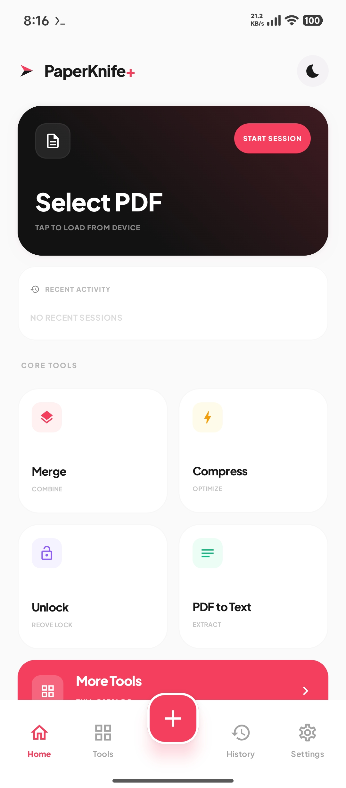
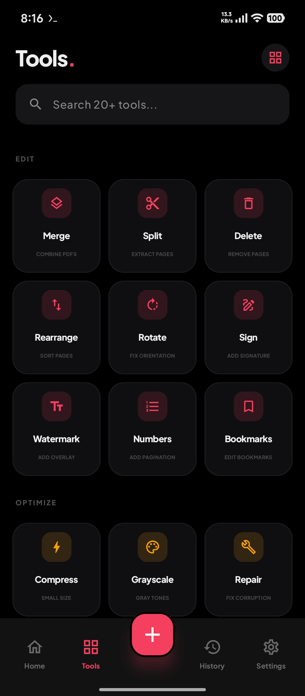
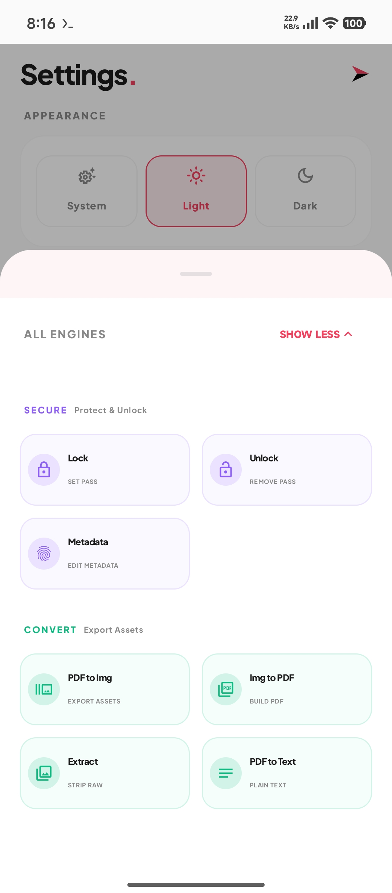
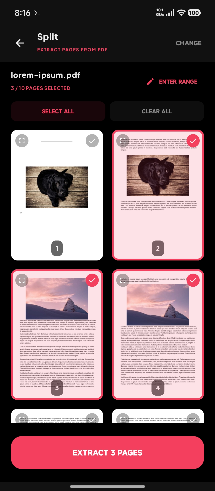

# PaperKnife+

A privacy-first PDF utility for Android. Works 100% offline - no internet, no trackers.

---

## Screenshots

  
  
  
  

---

## Features

- Merge & Split PDFs
- Password protect your PDFs  
- Convert Images to PDF
- Export PDF pages as Images (ZIP)
- Rotate and rearrange pages

All processing happens on your device. Your files never leave your phone.

---

## Support

---

## License

GPL-3.0-or-later
